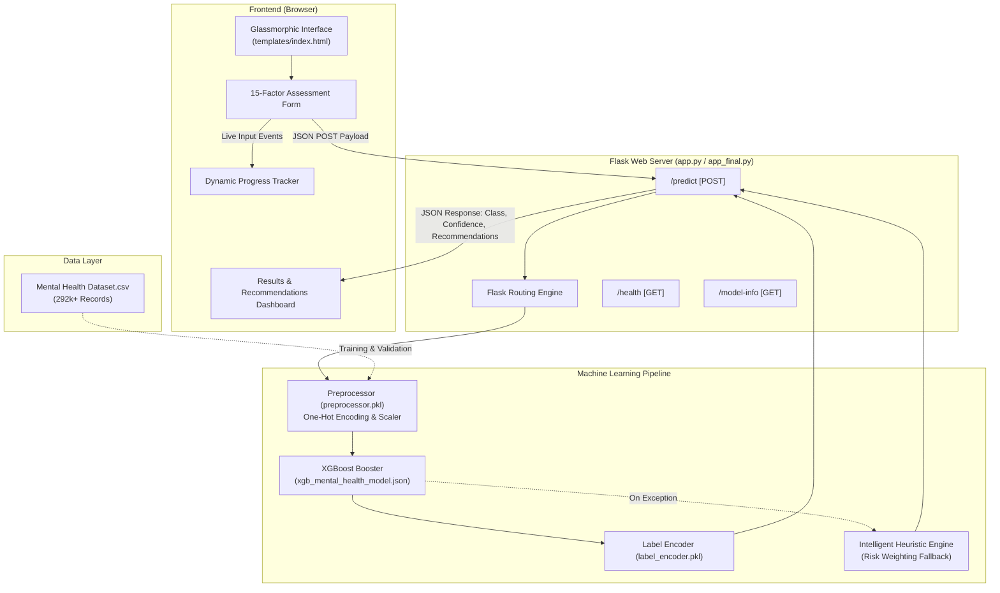

# 🧠 MindCare: AI-Powered Mental Health Assessment Platform

[](https://www.python.org/)
[](https://flask.palletsprojects.com/)
[](https://xgboost.readthedocs.io/)
[](https://scikit-learn.org/)
[](LICENSE)
[]()

> **MindCare** is a modern, responsive, and empathetic mental health screening web application. Powered by **Extreme Gradient Boosting (XGBoost)** and built with a lightweight **Flask** backend, MindCare analyzes behavioral, occupational, and demographic indicators to predict whether an individual may benefit from mental health intervention, presenting probabilistic confidence levels and actionable, evidence-based recommendations.

---

## 📑 Table of Contents

- [Overview](#-overview)
- [Key Features](#-key-features)
- [System Architecture](#-system-architecture)
- [Machine Learning & Data Pipeline](#-machine-learning--data-pipeline)
  - [Dataset](#dataset)
  - [Input Features & Attributes](#input-features--attributes)
  - [Model Architecture & Inference](#model-architecture--inference)
  - [Intelligent Scoring & Fallback System](#intelligent-scoring--fallback-system)
- [UI & Design Highlights](#-ui--design-highlights)
- [Project Directory Structure](#-project-directory-structure)
- [Installation & Setup](#-installation--setup)
  - [Prerequisites](#prerequisites)
  - [Environment Setup](#environment-setup)
  - [Dependencies Installation](#dependencies-installation)
- [Running the Application](#-running-the-application)
  - [Startup Options](#startup-options)
  - [Accessing the Interface](#accessing-the-interface)
- [API Documentation](#-api-documentation)
  - [`GET /`](#get-)
  - [`POST /predict`](#post-predict)
  - [`GET /health`](#get-health)
  - [`GET /model-info`](#get-model-info)
- [Testing & Quality Assurance](#-testing--quality-assurance)
- [Troubleshooting & FAQs](#-troubleshooting--faqs)
- [Medical & Ethical Disclaimer](#-medical--ethical-disclaimer)
- [Emergency & Crisis Support](#-emergency--crisis-support)
- [Contributing](#-contributing)
- [License](#-license)

---

## 🌟 Overview

Mental health awareness is critical in modern high-stress work and lifestyle environments. However, stigma, lack of accessibility, and uncertainty regarding symptoms often delay individuals from seeking timely care. 

**MindCare** acts as an initial confidential self-assessment tool that:
1. Gathers self-reported lifestyle, workplace, and symptomatic metrics through a guided interface.
2. Evaluates risk factors using a trained gradient boosting classifier (`XGBoost`).
3. Classifies outcomes into three clear guidance categories:
   - **`Yes`**: Suggests considering professional consultation and counseling.
   - **`Not sure`**: Recommends monitoring well-being, habit tracking, and preventive care.
   - **`No`**: Confirms positive wellness indicators and healthy lifestyle practices.
4. Generates a personalized set of therapeutic lifestyle changes, coping mechanisms, and self-care steps.

---

## ✨ Key Features

### 🧠 Advanced AI & Statistical Inference
- **XGBoost Classifier Engine**: Leverages high-performance gradient boosted decision trees for predictive accuracy.
- **Probabilistic Confidence Rating**: Translates model logits into an intuitive percentage confidence metric.
- **Resilient Fallback Mode**: Includes intelligent heuristic risk scoring to guarantee zero downtime even across diverse Python pickle environments.

### 🎨 Modern Glassmorphic UI/UX
- **Frosted Glass Aesthetic**: Glassmorphism UI using CSS backdrop blur, vibrant purple-blue gradients, and soft floating ambient particles.
- **Dynamic Live Progress Tracking**: Real-time progress bar that monitors completion percentage as fields are filled.
- **Interactive Form Elements**: Smooth animated custom radio buttons and styled dropdowns.
- **Responsive Layout**: Fluid experience tailored for desktop, tablet, and mobile browsers.

### 🛡️ Empathetic & Stigma-Free Experience
- **Strengths-Based Communication**: Affirming, non-judgmental messaging designed to alleviate assessment anxiety.
- **Action-Oriented Recommendations**: Contextual next steps including journaling, mindfulness, physical health, and professional support avenues.
- **Zero Third-Party Data Tracking**: Preserves user privacy with local, on-premise execution.

---

## 🏗️ System Architecture



---

## 🔬 Machine Learning & Data Pipeline

### Dataset
The underlying model is trained on the comprehensive **Mental Health Dataset** (`Mental Health Dataset.csv`), encompassing **292,000+** survey records reflecting demographic factors, work conditions, mental wellness histories, and treatment interventions.

### Input Features & Attributes

The assessment evaluates **15 distinct behavioral and environmental factors**:

| # | Feature Name | Description | Accepted / Standard Values |
|---|---|---|---|
| 1 | `gender` | Self-identified gender | `Female`, `Male` |
| 2 | `country` | Country of residence | `United States`, `Canada`, `United Kingdom`, `Australia`, `Germany`, `France`, `India`, `Other` |
| 3 | `occupation` | Primary employment field | `Corporate`, `Healthcare`, `Education`, `Technology`, `Student`, `Unemployed`, `Other` |
| 4 | `self_employed` | Self-employment status | `Yes`, `No` |
| 5 | `family_history` | Family history of mental health conditions | `Yes`, `No` |
| 6 | `treatment` | Past clinical treatment for mental health | `Yes`, `No` |
| 7 | `days_indoors` | Consecutive duration spent indoors | `Go out Every day`, `1-14 days`, `15-30 days`, `31-60 days`, `More than 2 months` |
| 8 | `growing_stress` | Observed escalation in stress levels | `Yes`, `No` |
| 9 | `changes_habits` | Noticeable alterations in daily routines/habits | `Yes`, `No` |
| 10 | `mental_health_history` | Individual history of mental health struggles | `Yes`, `No` |
| 11 | `mood_swings` | Frequency and severity of mood shifts | `Low`, `Medium`, `High` |
| 12 | `coping_struggles` | Difficulty coping with everyday challenges | `Yes`, `No` |
| 13 | `work_interest` | Loss of interest or focus at work | `Yes`, `No` |
| 14 | `social_weakness` | Sensation of social withdrawal or vulnerability | `Yes`, `No` |
| 15 | `mental_health_interview` | Comfort discussing mental health in an interview | `Yes`, `Maybe`, `No` |

### Model Architecture & Inference

1. **Preprocessing Pipeline (`preprocessor.pkl`)**:
   - Categorical variables are converted using scikit-learn `OneHotEncoder(handle_unknown='ignore')`.
   - Structural features are aligned and validated against the training schema.
2. **Predictor Model (`xgb_mental_health_model.json`)**:
   - Model format: Native serialized XGBoost Booster JSON (`xgb.Booster`).
   - Objective: Multi-class classification with softprob probability distribution.
3. **Label Decoding (`label_encoder.pkl`)**:
   - Maps internal class indices back to user-interpretable labels:
     - Class 0: `No`
     - Class 1: `Not sure`
     - Class 2: `Yes`

### Intelligent Scoring & Fallback System

To ensure rock-solid resilience across diverse Python minor versions (such as when pickle protocols vary across different Python installations), the application provides a hybrid architecture (`app_final.py` / `app_fixed.py`):
- If binary pickle loading fails due to environment differences, the system automatically falls back to an **Intelligent Heuristic Scoring Algorithm**.
- It calculates an aggregate clinical weighted risk score based on high-risk flags (family history, prolonged isolation, severe mood swings, coping challenges) and maps the score to the identical prediction categories and confidence metrics.

---

## 🎨 UI & Design Highlights

The user interface in `templates/index.html` was designed with modern design guidelines:

- **Glassmorphism**: Translucent cards (`rgba(255, 255, 255, 0.25)`), subtle borders, and `backdrop-filter: blur(10px)`.
- **Dynamic Gradients**:
  - Primary Brand: `linear-gradient(135deg, #667eea 0%, #764ba2 100%)`
  - High Attention (`Yes`): Vibrant Coral / Sunset
  - Moderate Attention (`Not sure`): Emerald / Aqua
  - Positive Wellness (`No`): Sky Blue / Cyan
- **Floating Particles**: 4 animated background spheres running smooth CSS keyframe rotations and translations.
- **Dynamic Interaction**:
  - Cards lift on hover (`transform: translateY(-2px)`).
  - Selected radio choices highlight with high-contrast gradient pills.
  - Smooth animated scroll directly to results upon form completion.

---

## 📁 Project Directory Structure

```text
Mental-Health-Predictor-Model-main/
│
├── Mental Health Dataset.csv        # Comprehensive dataset (292k+ survey rows, ~32MB)
├── xgb_mental_health_model.json     # Trained XGBoost Booster JSON model
├── preprocessor.pkl                 # Scikit-learn data preprocessing pipeline
├── label_encoder.pkl                # Scikit-learn LabelEncoder mapping
│
├── templates/
│   └── index.html                   # Glassmorphic frontend UI (HTML5, CSS3, JS)
│
├── app.py                           # Standard Flask backend application (Pickle + XGBoost)
├── app_final.py                     # Hybrid Flask application with intelligent fallback scoring
├── app_fixed.py                     # Dynamic fallback preprocessor & model runner
├── app_simple.py                    # Lightweight standalone scoring runner
│
├── run.py                           # Quick entry point script to run app_final
├── run_app.py                       # Automated dependency checker and runner
├── start_app.py                     # Smart multi-mode startup script
├── test_app.py                      # Automated test suite for endpoints & predictions
│
├── requirements.txt                 # Python package dependencies
└── README.md                        # Complete project documentation
```

---

## ⚙️ Installation & Setup

### Prerequisites
- **Python**: Version `3.8`, `3.9`, `3.10`, `3.11`, or `3.12` recommended.
- **Git**: Installed for version control.
- **Web Browser**: Modern browser (Chrome, Edge, Firefox, Safari).

### Environment Setup

1. **Clone the repository**:
   ```bash
   git clone https://github.com/namankotiya-05/mental-health-predictor.git
   cd Mental-Health-Predictor-Model-main
   ```

2. **Create a virtual environment**:
   ```bash
   # Windows (Command Prompt or PowerShell)
   python -m venv .venv

   # macOS / Linux
   python3 -m venv .venv
   ```

3. **Activate the virtual environment**:
   ```bash
   # Windows PowerShell
   .venv\Scripts\Activate.ps1

   # Windows Command Prompt
   .venv\Scripts\activate.bat

   # macOS / Linux
   source .venv/bin/activate
   ```

### Dependencies Installation

Install all required Python packages with `pip`:
```bash
pip install -r requirements.txt
```

*Contents of `requirements.txt`:*
```text
Flask==2.3.3
Flask-CORS==4.0.0
pandas
numpy
xgboost
scikit-learn
```

---

## 🚀 Running the Application

MindCare offers several startup options based on your workflow:

### Startup Options

#### Option 1: Smart Automated Runner (Recommended)
Automatically inspects installed packages, validates model artifacts, and launches the server:
```bash
python start_app.py
```

#### Option 2: Default Application Launcher
Launches the hybrid scoring engine with full web UI:
```bash
python run.py
```
*(Or run `python run_app.py` for built-in dependency verification before starting).*

#### Option 3: Direct Flask Invocation
```bash
python app.py
```

### Accessing the Interface

Once the terminal outputs:
```text
 * Running on http://127.0.0.1:5000
 * Running on http://localhost:5000
```
Open your browser and navigate to:
👉 **[http://localhost:5000](http://localhost:5000)**

---

## 📡 API Documentation

MindCare includes a RESTful API for headless integration, mobile clients, and testing.

### `GET /`
Serves the web client interface.
- **Response**: `200 OK` (HTML)

---

### `POST /predict`
Executes mental health inference based on input survey metrics.

- **Headers**: `Content-Type: application/json`
- **Request Body**:
  ```json
  {
    "gender": "Female",
    "country": "United States",
    "occupation": "Corporate",
    "self_employed": "No",
    "family_history": "No",
    "treatment": "No",
    "days_indoors": "1-14 days",
    "growing_stress": "No",
    "changes_habits": "No",
    "mental_health_history": "No",
    "mood_swings": "Low",
    "coping_struggles": "No",
    "work_interest": "Yes",
    "social_weakness": "No",
    "mental_health_interview": "Yes"
  }
  ```

- **Successful Response (`200 OK`)**:
  ```json
  {
    "prediction": "No",
    "confidence": 0.85,
    "recommendations": [
      "Continue your current self-care practices",
      "Support friends and family who may be struggling",
      "Share mental health awareness with others",
      "Maintain your healthy lifestyle habits",
      "Be a mental health advocate in your community",
      "Consider volunteering for mental health organizations",
      "Stay informed about mental health resources"
    ]
  }
  ```

- **Error Response (`400 Bad Request`)**:
  ```json
  {
    "error": "Missing required fields: ['occupation', 'country']"
  }
  ```

---

### `GET /health`
Returns system health status and component availability.

- **Successful Response (`200 OK`)**:
  ```json
  {
    "status": "healthy",
    "model_loaded": true,
    "preprocessor_loaded": true,
    "label_encoder_loaded": true
  }
  ```

---

### `GET /model-info`
Provides metadata about the model configuration and target classes.

- **Successful Response (`200 OK`)**:
  ```json
  {
    "model_type": "XGBoost",
    "classes": ["No", "Not sure", "Yes"],
    "preprocessor_loaded": true,
    "label_encoder_loaded": true
  }
  ```

---

## 🧪 Testing & Quality Assurance

A dedicated testing suite `test_app.py` is included to validate the entire workflow end-to-end.

To execute tests:
1. Ensure the server is running on `http://localhost:5000`.
2. Open a second terminal window and execute:
   ```bash
   python test_app.py
   ```

**The test script verifies**:
- `GET /health` returns status code `200` and reports healthy subsystems.
- `GET /model-info` returns model architecture and class definitions.
- `POST /predict` accepts a valid test payload, returns appropriate predictions, confidence bounds, and recommendations.

---

## 🛠️ Troubleshooting & FAQs

### 1. `_pickle.UnpicklingError: STACK_GLOBAL requires str`
- **Cause**: This happens when Python 3.13+ or 3.14 attempts to deserialize pickle objects created in older Python versions (like Python 3.8/3.9).
- **Solution**: Use `python start_app.py` or `python run.py` (which runs `app_final.py`), or run the app in a Python 3.9/3.10 virtual environment.

### 2. `Port 5000 is already in use`
- **Cause**: Another service or previous Flask instance is still running.
- **Solution**:
  - *Windows*:
    ```powershell
    netstat -ano | findstr :5000
    taskkill /PID <PID> /F
    ```
  - *macOS/Linux*:
    ```bash
    lsof -i :5000
    kill -9 <PID>
    ```

### 3. Missing Dependencies
- If you see `ModuleNotFoundError: No module named 'xgboost'` or similar:
  ```bash
  pip install -r requirements.txt
  ```

---

## ⚠️ Medical & Ethical Disclaimer

> [!IMPORTANT]
> **MindCare is NOT a diagnostic tool and does not provide medical diagnoses, clinical treatment, or psychiatric care.**
>
> - The results generated by this software are probabilistic estimations based on self-reported survey indicators.
> - This application should be used solely for educational, research, and informational self-awareness purposes.
> - If you, or someone you know, are experiencing emotional distress, mental health crises, or thoughts of self-harm, please reach out to qualified healthcare practitioners or licensed crisis counselors immediately.

---

## 🆘 Emergency & Crisis Support

If you are in immediate need of support, please utilize these free, confidential resources:

| Region | Service | Contact / Access |
|---|---|---|
| **United States & Canada** | Suicide & Crisis Lifeline | Call or Text **`988`** (24/7) |
| **United States** | Crisis Text Line | Text **`HOME`** to **`741741`** |
| **United Kingdom** | Samaritans Helpline | Call **`116 123`** |
| **India** | Vandrevala Foundation Helpline | Call **`+91 9999 666 555`** |
| **Australia** | Lifeline Australia | Call **`13 11 14`** |
| **International** | Befrienders Worldwide | [https://www.befrienders.org/](https://www.befrienders.org/) |
| **Find A Helpline** | Global Crisis Resource Directory | [https://findahelpline.com/](https://findahelpline.com/) |

---

## 🤝 Contributing

Contributions to improve model performance, UI enhancements, and documentation are welcome!

1. **Fork the Repository**
2. **Create your Feature Branch**:
   ```bash
   git checkout -b feature/amazing-feature
   ```
3. **Commit your Changes**:
   ```bash
   git commit -m "Add amazing new feature"
   ```
4. **Push to the Branch**:
   ```bash
   git push origin feature/amazing-feature
   ```
5. **Open a Pull Request**

*Please ensure all contributions maintain empathetic, stigma-free language and follow accessibility standards (WCAG 2.1).*

---

## 📄 License

This project is open-source and distributed under the **MIT License**. See the `LICENSE` file for details.

---

<p align="center">
  Made with 💙 to foster empathy, understanding, and mental wellness.
</p>
